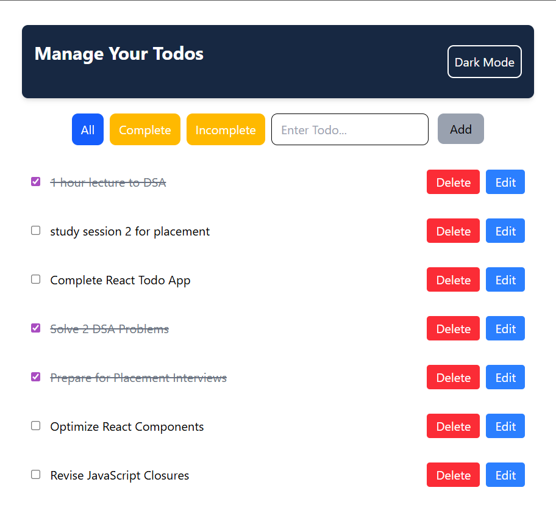
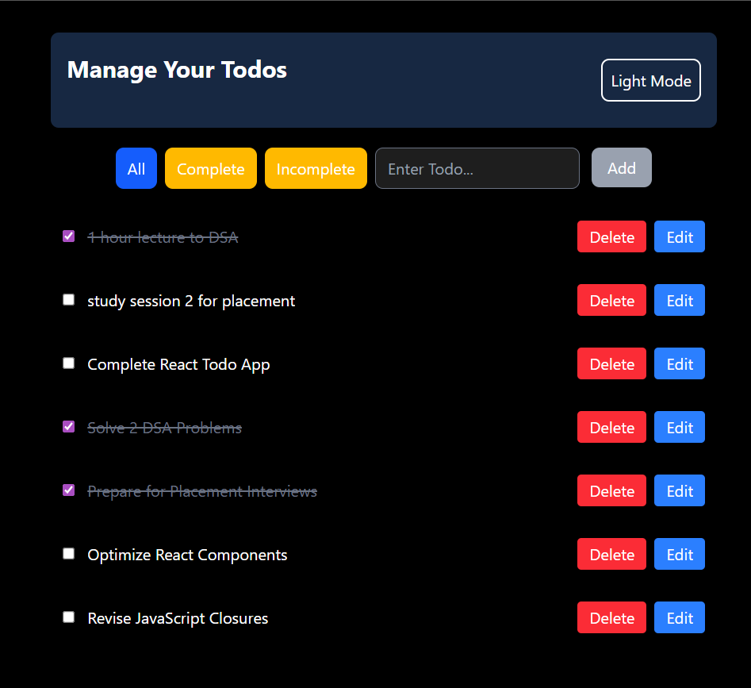
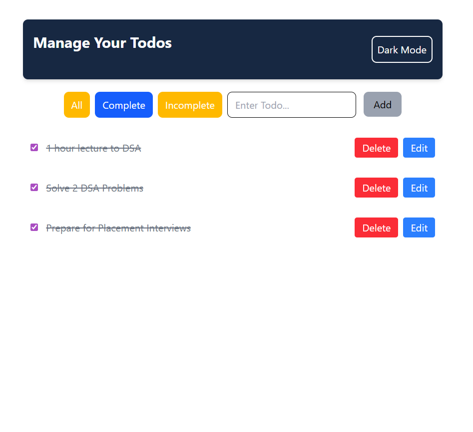
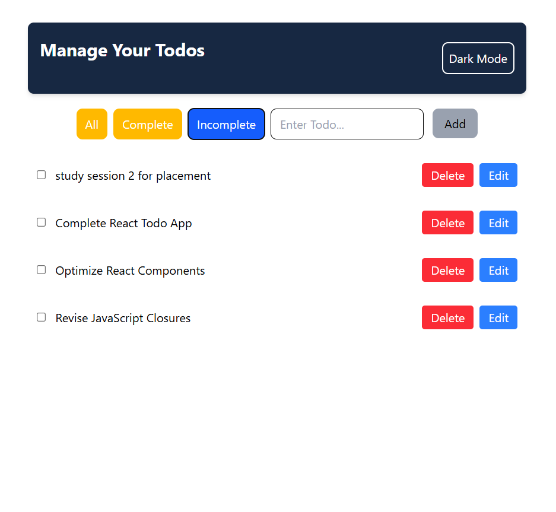
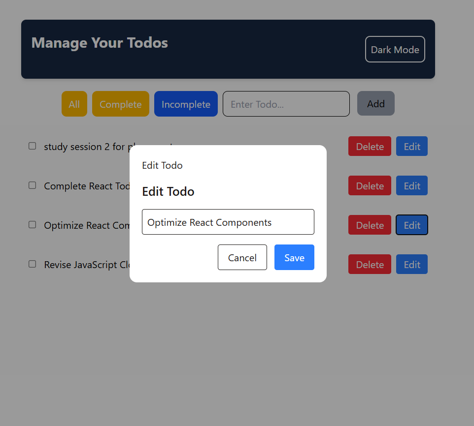

# 📝 React Todo App

A modern and responsive Todo Application built with **React.js** to revise and strengthen core React concepts. The application allows users to efficiently manage their daily tasks with features such as task creation, editing, deletion, completion tracking, persistent storage, and Light/Dark mode support.

## 🚀 Features

* ➕ Add new tasks
* ✏️ Edit existing tasks
* 🗑️ Delete tasks
* ✅ Mark tasks as completed
* 🌙 Light/Dark Mode Toggle
* 📱 Fully Responsive Design
* 💾 Data Persistence using Local Storage
* ⚡ Real-Time UI Updates
* 🎨 Clean and Modern User Interface

## 🛠️ React Concepts Used

This project was built as a practical revision of React fundamentals and commonly used concepts:

* Functional Components
* JSX
* Props
* State Management with `useState`
* Side Effects with `useEffect`
* Event Handling
* Conditional Rendering
* List Rendering using `map()`
* Form Handling
* Controlled Components
* Component Reusability
* Dynamic Styling
* Local Storage Integration
* Theme Management
* React Hooks
* Component-Based Architecture

## 📂 Project Structure

```bash
src/
├── assets/
├── component/
├── Context/
├── pages/
├── App.jsx
├── main.jsx
└── index.css
```

## 🎯 Learning Outcomes

* Built a complete CRUD application using React.
* Gained hands-on experience with React Hooks.
* Improved understanding of component communication.
* Implemented theme switching using React state.
* Learned data persistence with Local Storage.
* Practiced writing reusable and maintainable code.

## 🖥️ Tech Stack

* React.js
* JavaScript (ES6+)
* HTML5
* CSS3
* Vite
* Local Storage
* Tailwind CSS

## 📸 Screenshots

## 📸 Screenshots

<p align="center">
  
  
</p>

<p align="center">
  
  
</p>

<p align="center">
  
</p>

## 🌟 Future Improvements

* Task Categories
* Task Priority Levels
* Due Dates and Reminders
* Drag and Drop Functionality
* Backend Integration
* User Authentication


